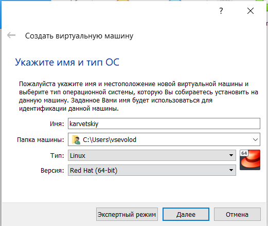
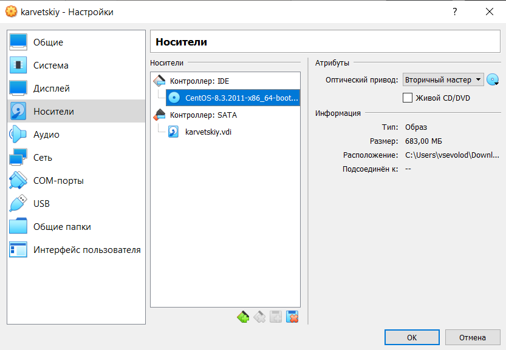
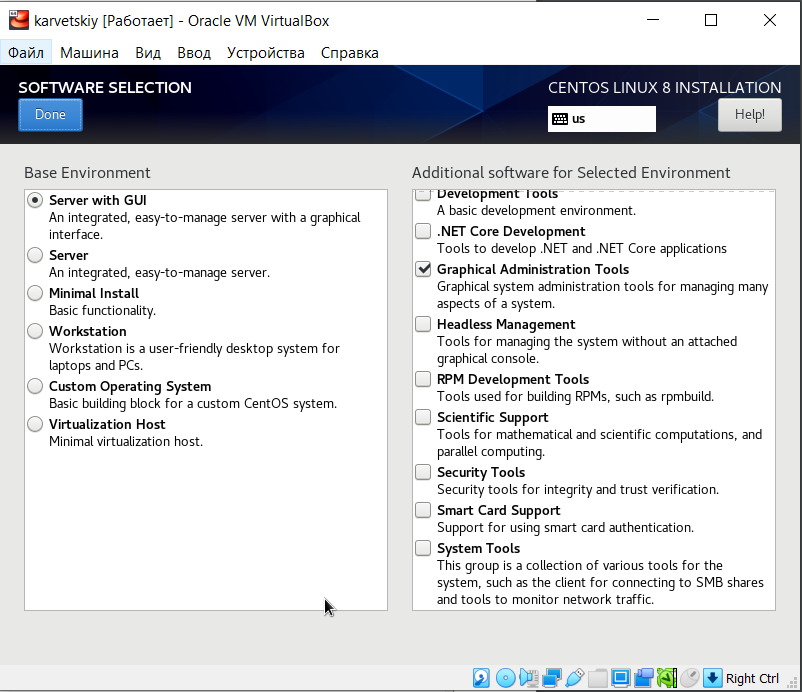
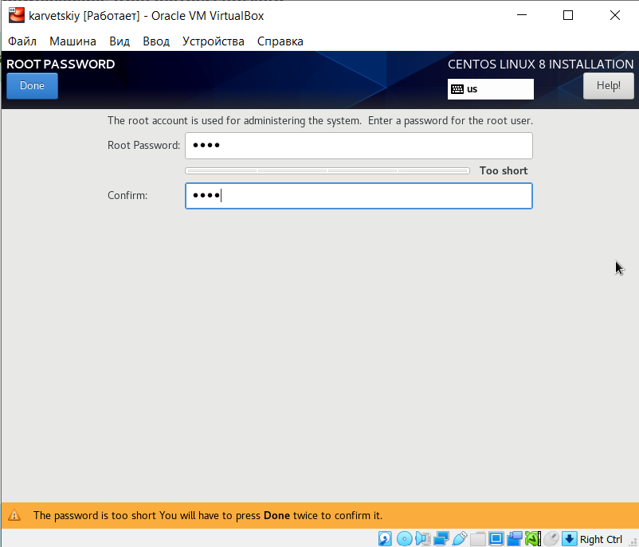
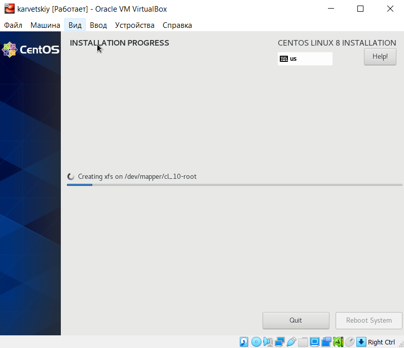

# Цель работы

Целью данной работы является приобретение практических навыков установки операционной системы на виртуальную машину, настройки минимально необходимых для
дальнейшей работы сервисов.

# Задание

Установить и настроить для дальнейшей работы виртуальную машину Linux

# Выполнение лабораторной работы

1. Я установил на личный компьютер Oracle Virtual Machine

2. Настраиваю VM для установки Linux CentOS
	- Указываю имя виртуальной машины и тип гостевой ОС
	
	- Выделяю для работы 1024 Мб оперативной памяти
	
	- Создаю виртуальный диск типа VDI объемом 30 Гб
	
	- Подключаю образ ОС Linux CentOS, скачанный с официального сайта
	
3. Пошаговая установка и настройка CentOS
	- В разделе "Выбор приложений" выбираем "Сервер с GUI"
	
	- Установка пароля администратора
	
	- Отключаю KDUMP
	
	- Ожидаю окончания установки
	
{ #fig:001 width=70% }

# Выводы

Здесь кратко описываются итоги проделанной работы.
