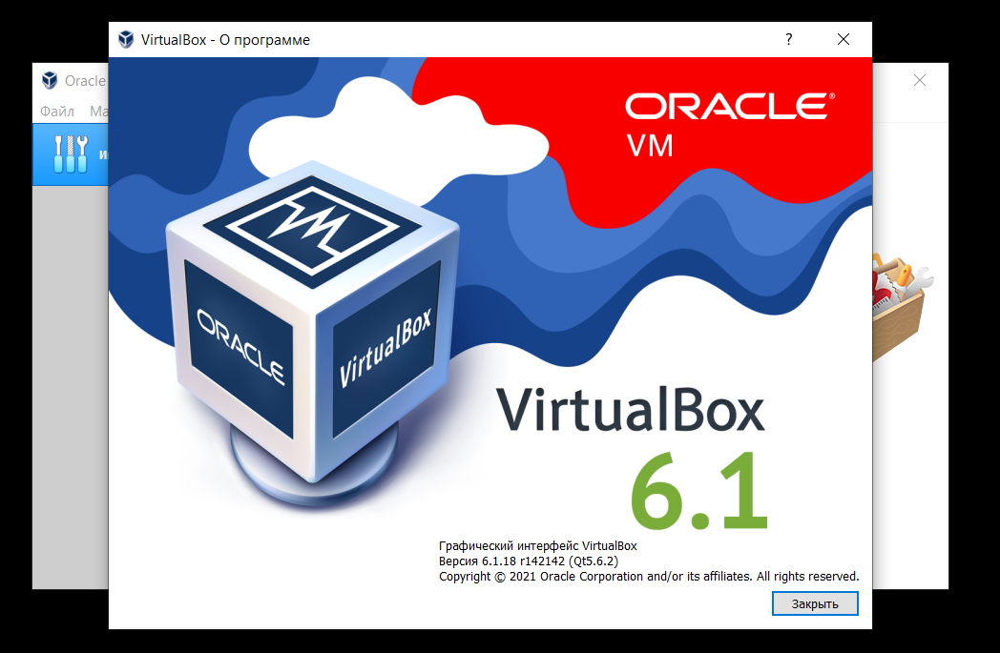
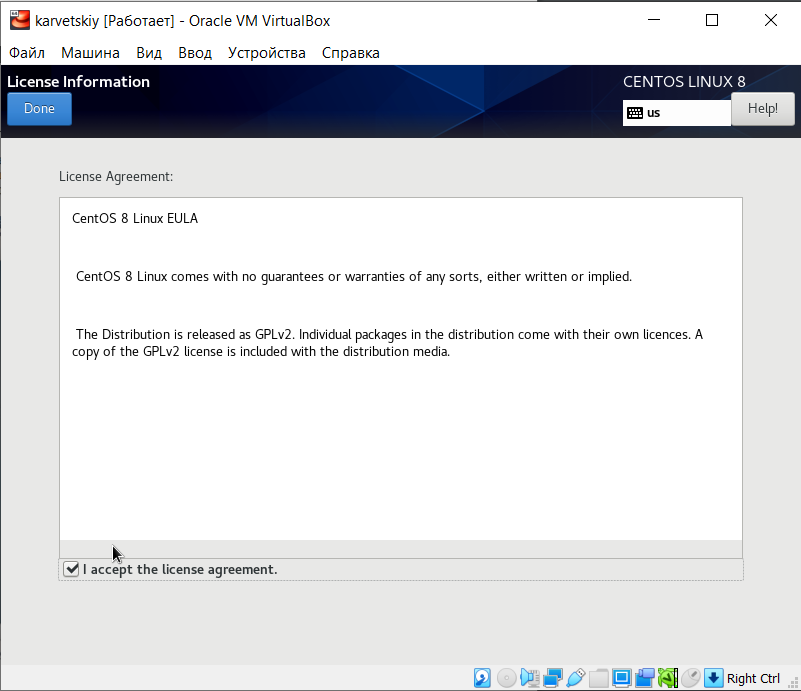
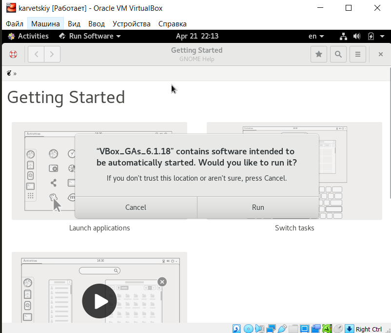
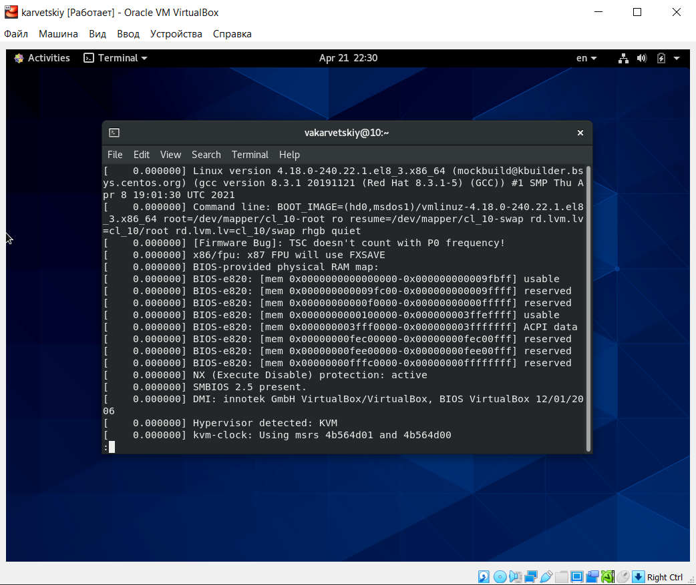
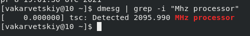
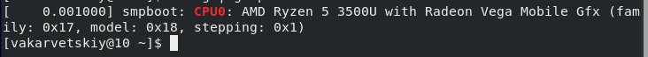
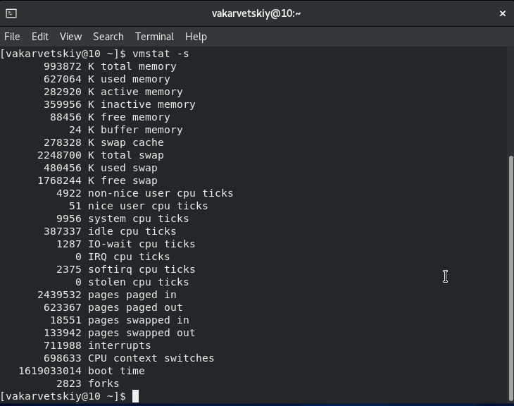
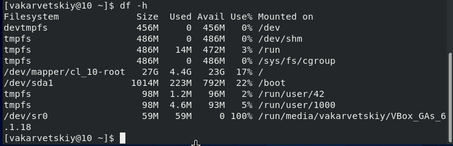

# Цель работы

Целью данной работы является приобретение практических навыков установки операционной системы на виртуальную машину, настройки минимально необходимых для
дальнейшей работы сервисов.

# Задание

Установить и настроить для дальнейшей работы виртуальную машину Linux


# Выполнение лабораторной работы

1. Я установил на личный компьютер Oracle Virtual Machine (см. [1.1](image/1.1.png))  

2. Настраиваю VM для установки Linux CentOS  
	- Указываю имя виртуальной машины и тип гостевой ОС (см. [2.1](image/2.1.png))  
	
	- Выделяю для работы 1024 Мб оперативной памяти (см. [2.2](image/2.2.png))  
	
	- Создаю виртуальный диск типа VDI объемом 30 Гб (см. [2.3](image/2.3.png))  
	
	- Подключаю образ ОС Linux CentOS, скачанный с официального сайта (см. [2.4](image/2.4.png))  
	
3. Пошаговая установка и настройка CentOS  
	- В разделе "Выбор приложений" выбираем "Сервер с GUI" (см. [3.1](image/3.1.png)) 
	
	- Установка пароля администратора (см. [3.2](image/3.2.png))  
	
	- Отключаю KDUMP (см. [3.3](image/3.3.png))  
	
	- Ожидаю окончания установки (см. [3.4](image/3.4.png))  
	
	- Принимаем лицензионное соглашение (см. [3.5](image/3.5.png))  
	
4. Подключаю образ диска дополнений гостевой ОС (см. [4.1](image/2.1.png))  


# Домашнее задание

1. Анализирую последовательность загрузки системы с помощью команды ```dmesg | less``` (см. [hw1](image/hw1.png))  

2. Получаем необходимую информацию с помощью команды ```dmesg | grep -i "..."```  
    1. Версия ядра линукс (см. [hw2](image/hw2.png))  
    
    2. Частота процессора (см. [hw3](image/hw3.png))  
    
    3. Модель процессора (см. [hw4](image/hw4.png))  
    
    4. Объем доступной оперативной памяти (см. [hw5](image/hw5.png))  
    
    5. Тип обнаруженного гипервизора (см. [hw6](image/hw6.png))  
    
    6. Тип файловой системы корневого раздела (см. [hw7](image/hw7.png))  
    
    7. Последовательность монтирования файловых систем (см. [hw8](image/hw8.png))  
    

# Выводы

Данная лабораторная работа помогла мне научиться устанавливать и использовать виртуальную машину для работы.
Я научился производить первоначальную настройку Oracle VM для работы с ОС CentOS.
Также я научился использовать команду ```dmesg``` для поиска нужной информации о системе.

# Контрольные вопросы

1. Учетная запись пользователя содержит такие команды, как:
	- Системное имя пользователя
	- Пароль
	- Уникальный идентификатор пользователя (UID)
	- Идентификатор группы пользователя (GID)
	- Директория, в которой работает пользователь

2. Команды терминала:
	1. Для получения справки по команде используется флаг ```--help``` или ```-h```, 
	например ```cd --help```
	2. Для перемещения по файловой системе используется команда ```cd```,
	например 
	```cd downloads``` - перемещение в каталог "downloads" 
	```cd ..``` - перемещение в корневой каталог
	3. Для просмотра содержимого каталога используется команда ```ls```
	4. Для определения объема каталога используется команда ```du```
	Для удобства лучше использовать с ключами ```-s``` и ```-h```
	например ```du -hs /downloads```
	5. Чтобы создать файл или каталог, используются команды ```touch``` и ```mkdir``` соответственно
	например ```touch text.txt```, ```mkdir downloads2```
	Чтобы удалить файл или каталог, используются команды ```rm``` и ```rmdir``` соответственно
	например ```rm text.txt```, ```rmdir downloads2```
	6. Для создания и редактирования прав файла/каталога используют ```chmod```
	например ```chmod 777 text.txt```
	7. Для просмотра истории команд используют  ```history```
3. Файловая система - это порядок, определяющий организацию, структуру, хранение и именование на определенном логическом носителе
Примеры наиболее распространенных файловых систем: *NTFS*, *FAT32*, *exFAT*
4. Узнать, какие ФС смонтированы в ОС, можно узнать с помощью команды ```mount```
5. Можно использовать команду ```killall *Process Name*```
