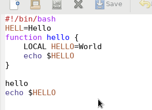

# Цель работы

Познакомиться с операционной системой Linux. Получить практические навыки работы с редактором Emacs.

# Задание

Изучить интерфейс и основные сочетания клавиш редактора emacs

# Выполнение лабораторной работы

1. Открыл emacs(см. [1](image/1.png))  
  
2. Создал файл lab07.sh(см. [2](image/2.png))  
  
3. Набрал текст из задания(см. [3](image/3.png))  
  
4. Сохранил файл(см. [4](image/4.png))  
  
5.
	1. Вырезал строку одной командой(см. [5.1](image/5.1.png))  
	  
	2. Вставил эту строку в конец файла(см. [5.2](image/5.2.png))  
	  
	3. Выделил область текста(см. [5.3](image/5.3.png))  
	  
	4. Скопировал ее в буфер обмена(см. [5.4](image/5.4.png))  
	  
	5. Вставил область в конец файла(см. [5.5](image/5.5.png))  
	  
	6. Еще раз выделил область и вырезал ее(см. [5.6](image/5.6.png))  
	  
	7. Отменил последнее действие(см. [5.7](image/5.7.png))  
	  
6. 
	1. Переместил курсор в начало строки(см. [6.1](image/6.1.png))  
	  
	2. Переместил курсор в конец строки(см. [6.2](image/6.2.png))  
	  
	3. Переместил курсор в начало буфера(см. [6.3](image/6.3.png))  
	  
	4. Переместил курсор в конец буфера(см. [6.4](image/6.4.png))  
	  
7. 
	1. Вывел список буферов(см. [7.1](image/7.1.png))  
	  
	2. Переключился на другой буфер(см. [7.2](image/7.2.png))  
	  
	3. Закрыл окно(см. [7.3](image/7.3.png))  
	  
	4. Переключился между буферами без вывода на экран(см. [7.4](image/7.4.png))  
	  
8. 
	1. Поделил фрейм на 4 части(см. [8.1](image/8.1.png))  
	  
	2. В каждом фрейме открыл разные файлы и ввел текст(см. [8.2](image/8.2.png))  
	  
9. 
	1. Нашел слова в режиме поиска(см. [9.1](image/9.1.png))  
	  
	2. Переключился между результатами(см. [9.2](image/9.2.png))  
	  
	3. Вышел из режима поиска(см. [9.3](image/9.3.png))  
	  
	4. Нашел и заменил слово(см. [9.4](image/9.4.png))  
	  
	5. Использовал другой режим поиска. Отличие в том, что при использовании данного режима, в отдельном окне показываются все результаты поиска(см. [9.5](image/9.5.png))  
	  

# Выводы

Я научился работать в графическом редакторе emacs, изучил основные команды и сочетания клавиш для работы с ним. 