# Цель работы

Изучить идеологию и применение средств контроля версий.
Научиться использовать систему контроля версии в своих проектах

# Задание

Настроить git на своем компьютере, инициализировать локальный репозиторий в папке с лабораторными работами,
добавить все нужные файлы в репозиторий, подключить удаленный репозиторий с github, связать локальный и удаленные репозитории


# Выполнение лабораторной работы
0. На моем личном компьютере система Git уже была настроена

1. Подключение локального репозитория к GitHub
	1. Инициализируем локальный репозиторий
	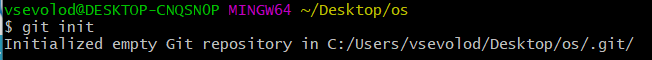
	2. Добавляем файлы в репозиторий
	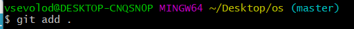
	3. Делаем коммит
	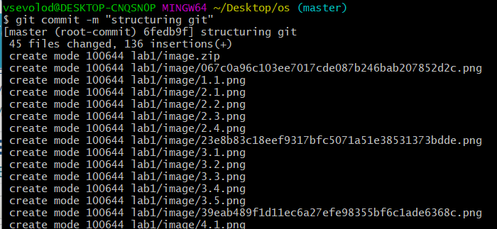
	4. пуш на гитхаб
	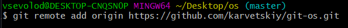
	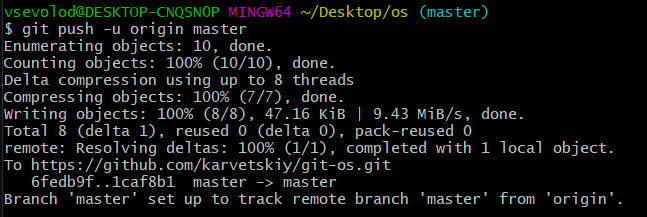
	5. Проверяем репозиторий на гитхабе
	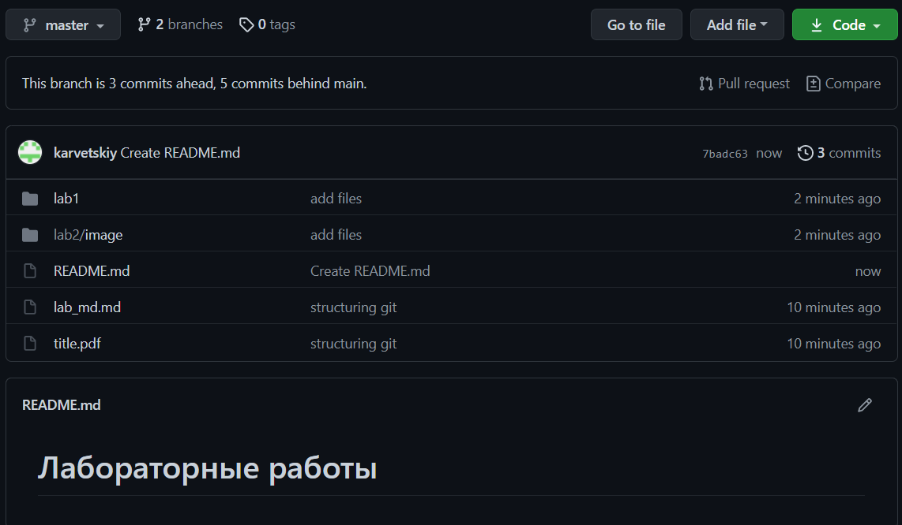

2. Конфигурация Git
	1. Добавил файл лицензии с помощью ```wget```
	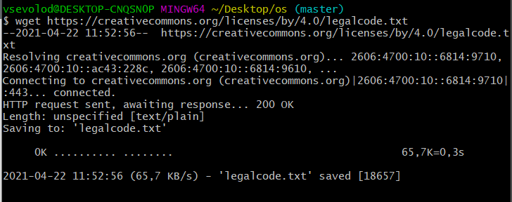
	2. Подгрузил список доступных шаблонов игнорируемых файлов
	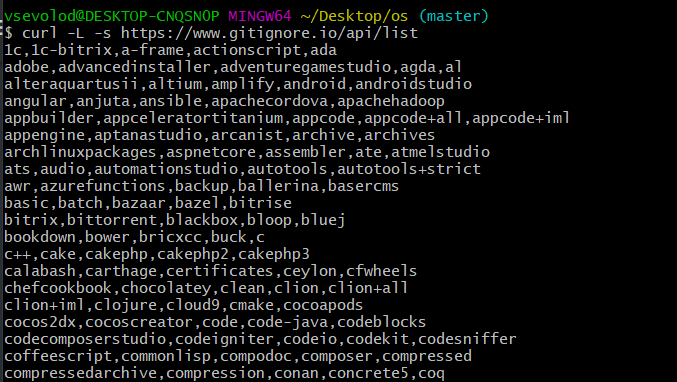
	3. Выбрал и загрузил шаблон для C++
	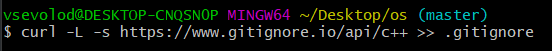
	4. Пуш на GitHub
	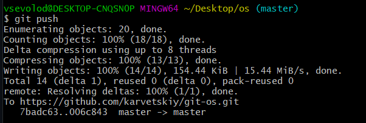

3. Конфигурация GitFlow
	1. Инициализирую GitFlow
	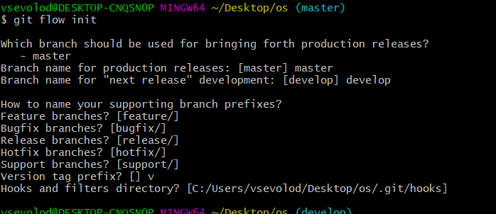
	2. Переключаюсь на ветку ```develop```
	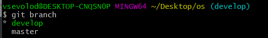
	3. Создаю релизную версию ```1.0.0```
	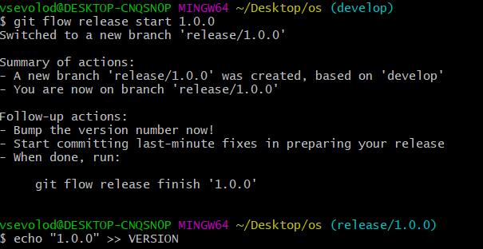
	4. Добавил туда нужные файлы и закрыл релизную ветку
	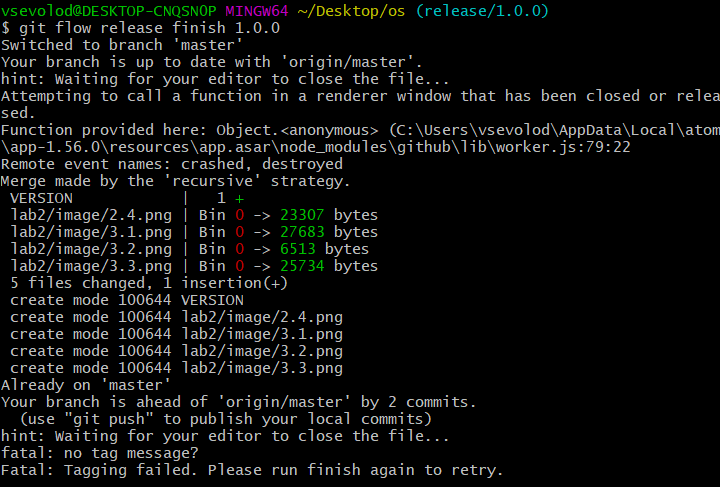
	5. Пушим все ветки на гит
	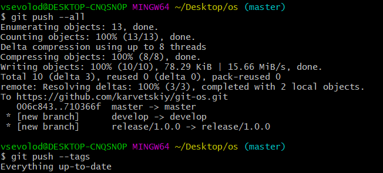


# Выводы

Выполняя данную лабораторную работу, я научился пользоваться ```Git```, а именно: инициализировать локальный
репозиторий, подключать удаленные репозитории, добавлять и удалять нужные файлы, синхронизировать данные.
Также я научился использовать ```Git Flow```, который очень сильно упрощает разработку проектов и навигацию между ветками

# Контрольные вопросы

1. Системы контроля версий  - это программное обеспечение, которое используется для облегчения работы с изменяющейся информацией, обычно - с проектами. Чаще всего применяется в разработке, когда над одним проектом работает большое количество людей
2. 
	- Хранилище в системе контроля версий - это удаленный репозиторий, где хранятся все файлы проекта
	- commit - это фиксация изменений перед загрузкой файлов в систему контроля версий
	- история хранит все изменения проекта, и в случае необходимости позволяет откатиться к нужному месту
	- рабочая копия - это копия проекта на компьютере разработчика. Если другой член команды изменил проект, необходимо загрузить новую версию проекта себе на компьютер
3. Централизованные системы контроля версий хранят данные о проекте на едином сервере, и в случае его отключения, доступ к данным будет утерян (Perforce)
В децентрализовынных системах у каждого из участников проекта на компьютере хранитсяя полная копия проекта, что позволяет меньше зависеть от сервера (Git)
4. Сначала надо создать и подключить удаленный репозиторий. Затем, т.к. никто кроме тебя не изменяет проект, по мере изменения проекта пушить изменения на сервер, и нет необходимости загружать изменения
5. Каждый раз перед разработкой необходимо загрузить актуальную версию проекта на свой компьютер, а уже потом раюотать над ним. После работы необходимо закоммитить изменения и запушить на сервер
6. Упрощение обмена информацией, ускорение разработки, устранение ошибок и недоработок во время разработки.
7. 
	- ```git init``` - инициализирует локальный репозиторий
	- ```git add``` - добавляет файлы в репозиторий
	- ```git commit``` - коммит версии
	- ```git pull``` - загружает актуальную версию проекта
	- ```git push``` - отправляет измененный проект на сервер
	- ```git checkout``` - позволяет переключаться между ветками
	- ```git status``` - текущий статус проекта
	- ```git branch``` - просмотр доступных веток
	- ```git remote add``` - добавление удаленного репозитория
8. 
Если я забыл, в какой ветке нахожусь, то с помощью ```git branch``` могу посмотреть это.
Если мне нужно подключить систему контроля версий к уже существующему проекту, то я инициализирую локальный репозиторий ```git init``` и подключаю удаленный ```git remote add```, затем добавляю все файлы ```git add``` и коммичу их ```git commit```, затем пушу на удаленный репозиторий ```git push```. Теперь к моему проекту подключена система контроля версий
9. Ветки нужны для разделения разработки. Например, когда разрабатывается новая фича, не нужно, чтобы она присутствовала в основном проекте, поэтому для нее создают отдельную ветку. В случае успешной разработки фичи, эту ветку сливают с основной. Так убираются риски багов, ошибок, а также утечки данных
10. Есть временные и системные файлы, которые засоряют проект и не нужны. путь к ним можно добавить в файл ```.gitignore```, тогда они не будут добавляться в проект

