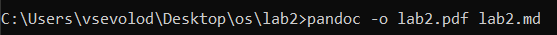

# Цель работы

Научиться оформлять отчёты с помощью легковесного языка разметки Markdown

# Задание

– Сделайте отчёт по предыдущей лабораторной работе в формате Markdown.  
– В качестве отчёта просьба предоставить отчёты в 3 форматах: pdf, docx и md (в
архиве, поскольку он должен содержать скриншоты, Makefile и т.д.)


# Выполнение лабораторной работы

1. Я взял файл отчета предыдущей лабораторной работы
2. С помощью ```pandoc``` получил из marcdown файла docx и pdf (см. [1.1](image/1.1.png), [1.2](image/1.2.png))  
  


# Выводы

Я научился преобразовывать marcdown файлы в различные форматы

