# Цель работы

Познакомиться с операционной системой Linux, получить практические навыки работы с консолью и некоторыми графическими менеджерами рабочих столов операционной системы.

# Задание

Изучить элементы управления графической средой, терминалом. Найти отличия при работе с разными графическими средами

# Выполнение лабораторной работы

1. Я загрузил виртуальную машину (см. [1.1](image/1.1.png))  
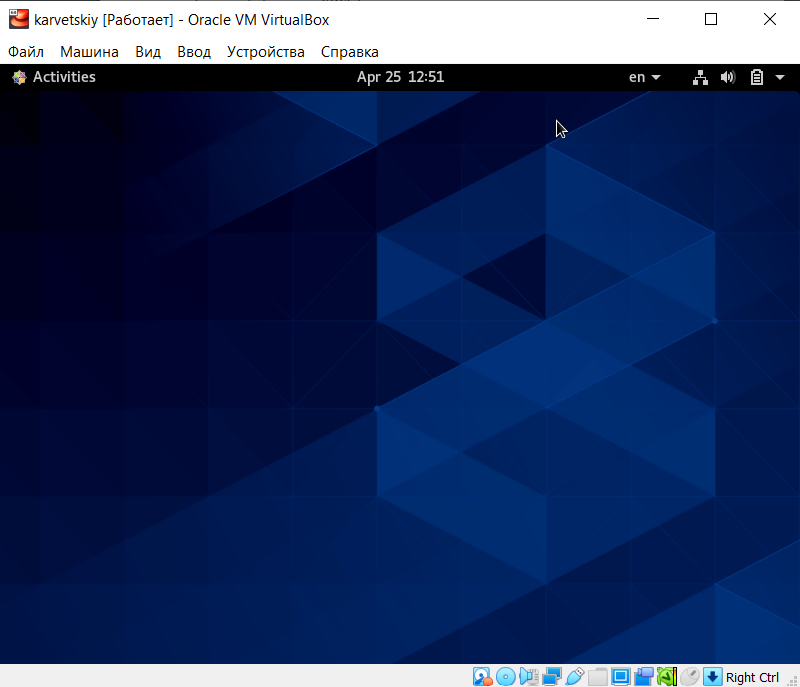
2. Перешел в текстовую консоль с помощью сочетания ```Ctrl + Alt + F3```. У меня доступно 4 виртуальные консоли. (см. [2.1](image/2.1.png))  
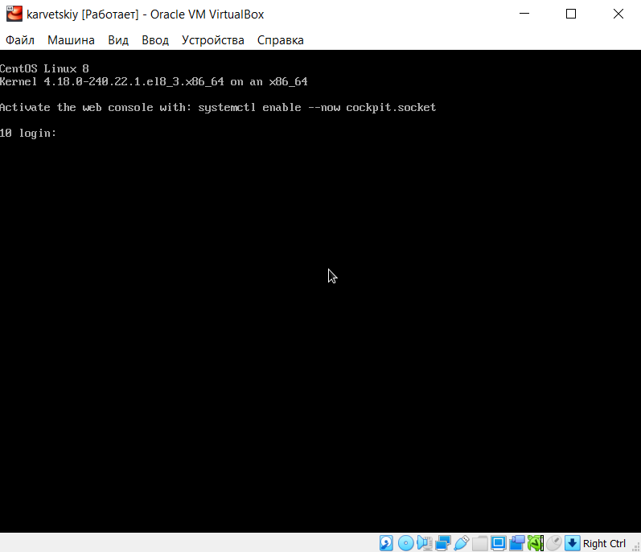
3. Вошел под своим логином. При вводе пароля не отображаются никакие символы. (см. [2.2](image/2.2.png)) 
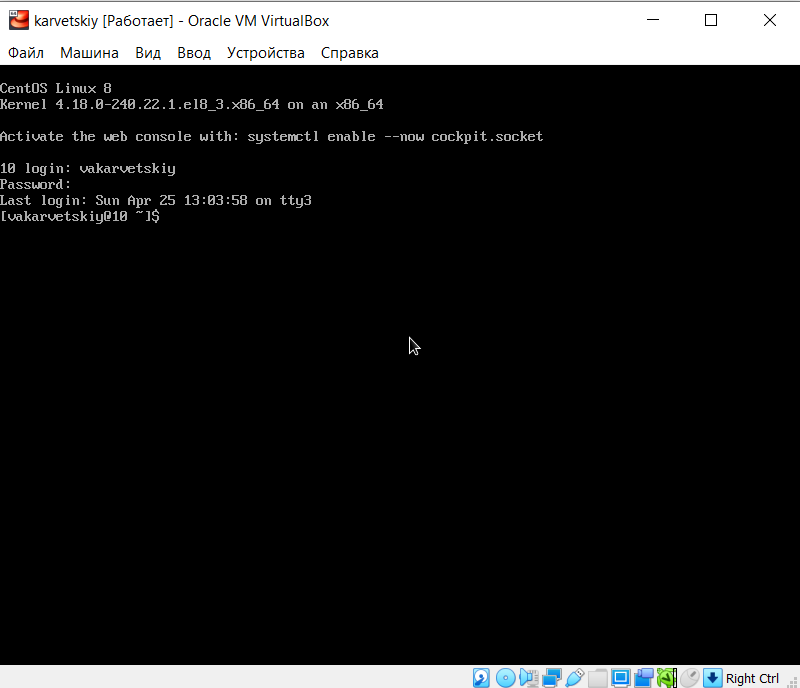
4. Завершил консольный сеанс, для этого использовал команду ```logout```, чтобы переключиться на графический интерфейс, использовал сочетание ```Ctrl + Alt + F1``` (см. [2.3](image/2.3.png))  
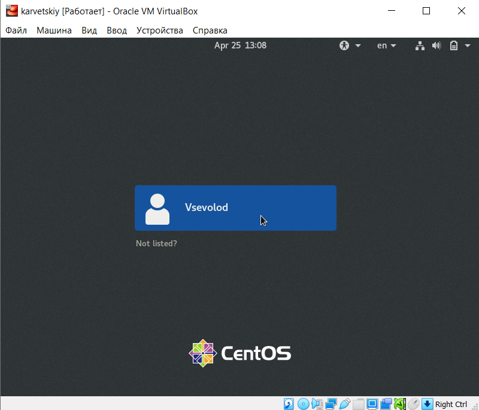
5. У меня установлен менеджер рабочих столов X Window Manager (см. [4.1](image/4.1.png))  
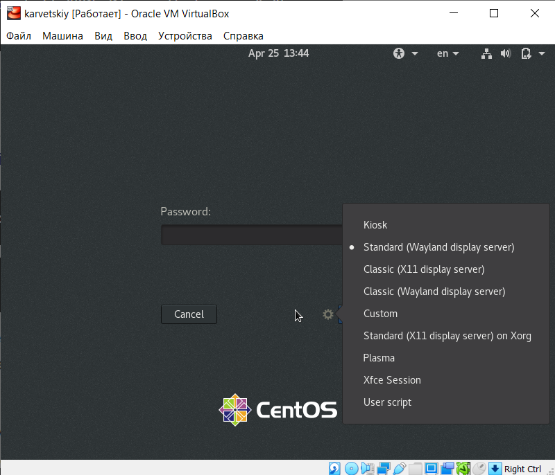
6. Различные графические окружения:  
	- GNOME (default) (см. [gnome](image/gnome.png))  
	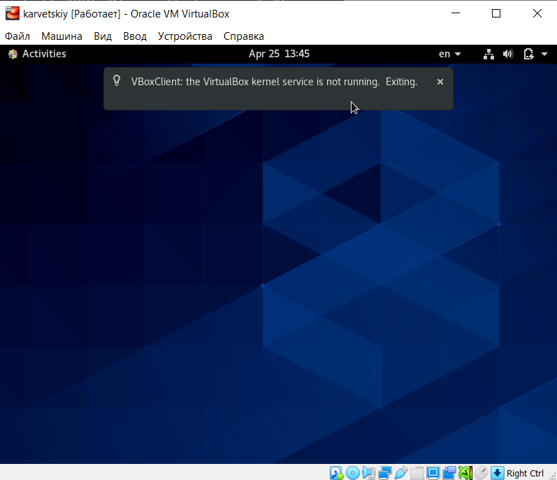
	- KDE (см. [kde](image/kde.png))  
	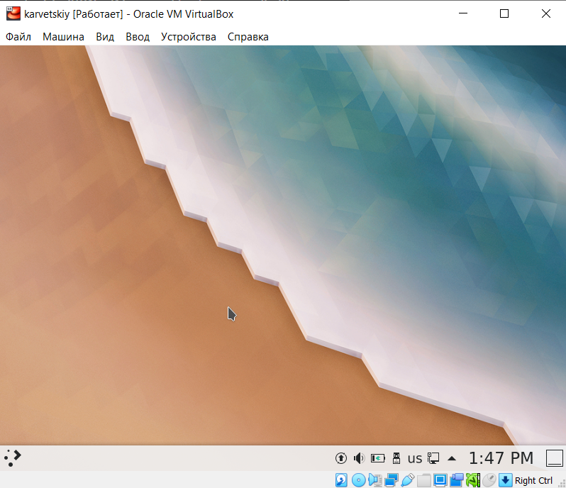
	- XFCE (см. [xfce](image/xfce.png))  
	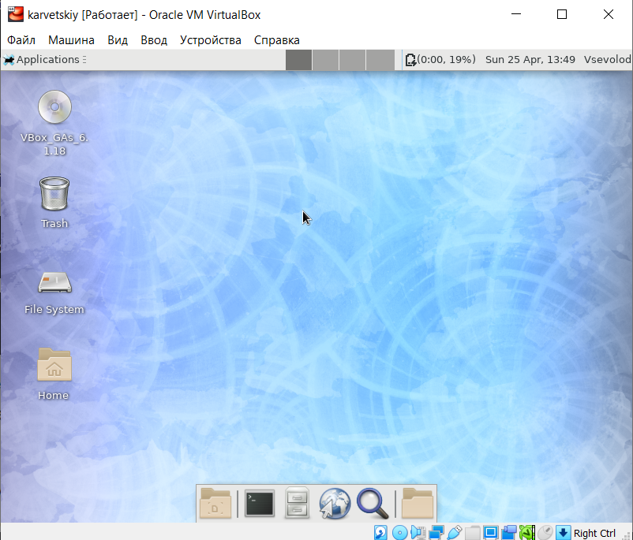  
7. Запустил поочередно программы:  
	- Mozilla Firefox (см. [5.1](image/5.1.png))  
	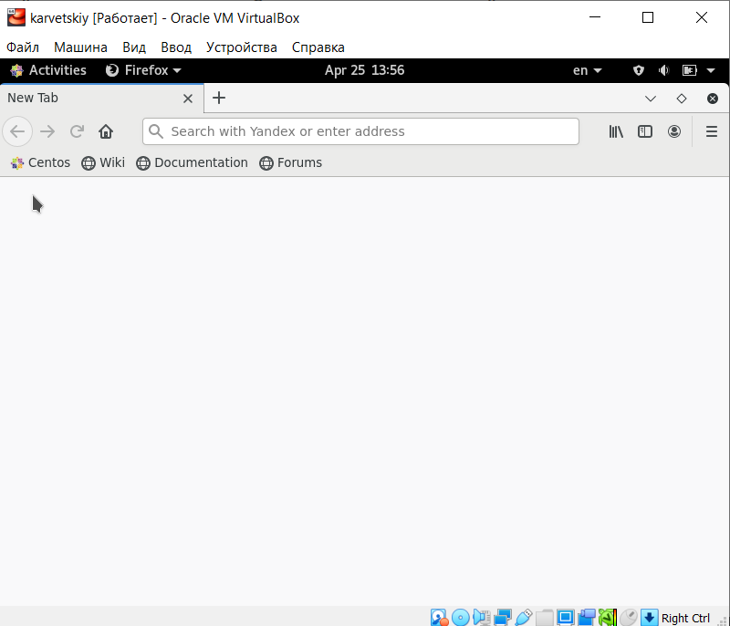
	- Text Editor (см. [5.2](image/5.2.png))  
	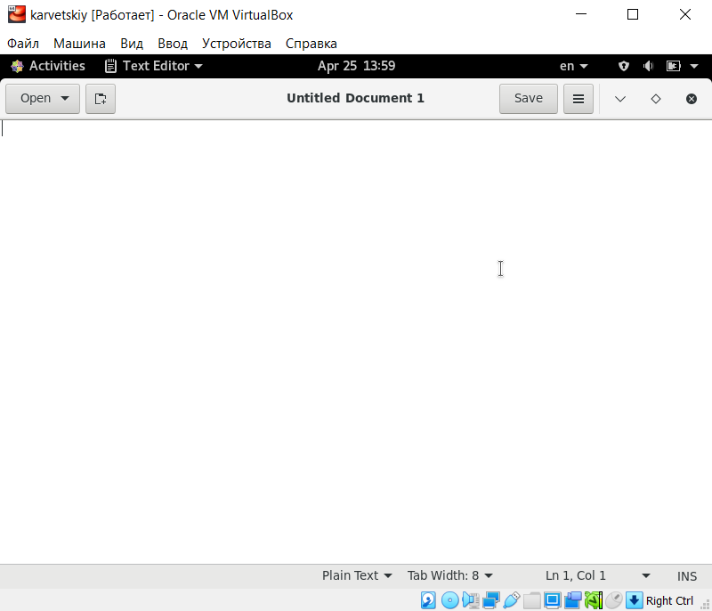
	- LibreOffice Writer (см. [5.3](image/5.3.png))  
	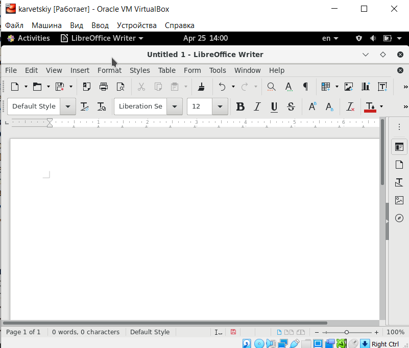
	- Terminal (см. [5.4](image/5.4.png))  
	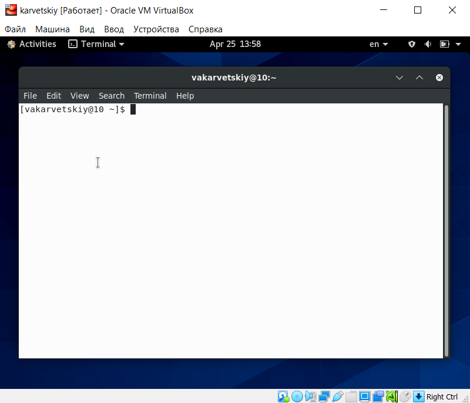  

# Выводы

Я научился переключаться между графическими оболочками, усстанавливать новые. Научился переключаться между графическим и текстовым окружениями. Познакомился с менеджером рабочих столов

# Контрольные вопросы

1. Компьютерный терминал - это интерфейс, позволяющий пользователю взаимодействовать с компьютером и его устройствами. 
Неоспоримым преимуществом является нетребовательность к железу, что позволяет раюотать даже на компьютерах с минимальной конфигурацией. Также исключаются баги и фризы GUI, что также ускоряет работу.  
2. Имя, под которым пользователь логинится в системе  
3. Пароли хранятся в скрытом файле /etc/shadow, который скрыт от обычных пользователей  
4. В домашнем каталоге пользователя  
5. root  
6. Да, имеет  
7. Иерархия пользователей, в зависимости от выданных прав. Для всех каталогов и файлов используются модификаторы доступа, которые позволяют регулировать действия других пользователей  
8. UID, GID, GECOS, домашнюю директорию, версию shell  
9. 
UID - уникальный идентификатор пользователя  
GID - групповой идентификатор пользователя  
10. GECOS - номер поля учетной записи в файле /etc/passwd  
11. Домашний каталог - это каталог пользователя, в котором хранятся все его файлы и данные  
12. /home/vakarvetskiy   
13. Да, администратор может изменять содержимое домашнего каталога пользователя  
14. В этом файле хранятся данные об учетных записях пользователей  
15. Если в поле пароля стоит символ *, то пользователь не сможет войти в систему  
16. Виртуальные консоли - это представление многотерминальной раюоты в рамках одного устройства. В данном контексте вируальные - значит, что они все равно работают с этим устройством 
17. Для управления консолями, как физическими, так и виртуальными  
18. Это процесс обмена информацией пользователя и компьютера после авторизации пользователя и до завершения сеанса пользователем  
19. Готовый набор программ для определенных целей
20.  GTK, GTK+, GDK, Qt