# Цель работы

Приобретение практических навыков взаимодействия пользователя с системой посредством командной строки.

# Задание

Познакомиться с основными командами терминала, научиться их использовать для работы

# Выполнение лабораторной работы

1. Определил полный путь к домашнему каталогу(см. [1.1](image/1.1.png))  
  
2. 
	1. Перешел в каталог /tmp(см. [2.1](image/2.1.png))  
	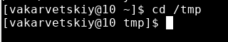  
	2. Вывел содержимое каталога
		1. Команда без опций выводит только имена файлов(см. [2.2.1](image/2.2.1.png))  
		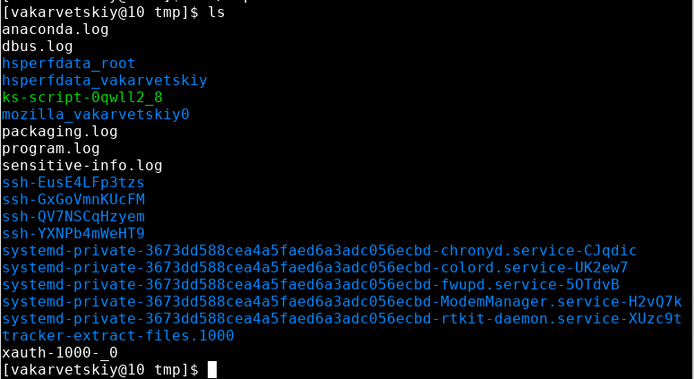  
		2. Команда с опцией -а выводит также скрытые файлы(см. [2.2.2](image/2.2.2.png))  
		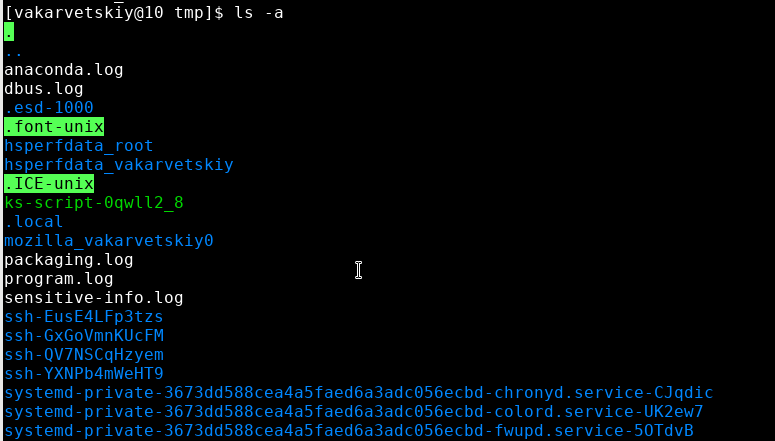  
		3. Команда с опцией -alF выводит все файлы, а также подробную информацию о них(см. [2.2.3](image/2.2.3.png))  
		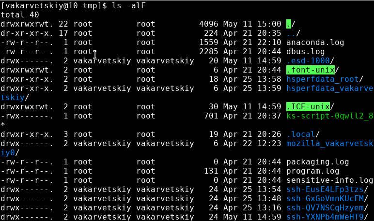  
	3. Подкаталога с именем cron в каталоге нет(см. [2.3](image/2.3.png))  
	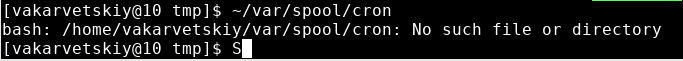  
	4. Вывел содержимое домашнего каталога с информацией о владельцах файлов(см. [2.4](image/2.4.png))  
	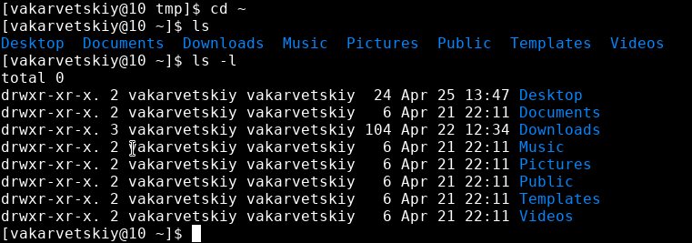  
3. 
	1. Создал новый каталог newdir(см. [3.1](image/3.1.png))  
	  
	2. В нем создал подкаталог morefun(см. [3.2](image/3.2.png))  
	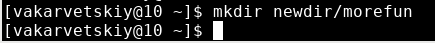  
	3. Создал и удалил три каталога одной командой(см. [3.3](image/3.3.png))  
	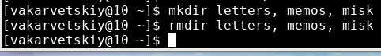  
	4. Попробовал удалить каталог newdir командой rm, он не удалился(см. [3.4](image/3.4.png))  
	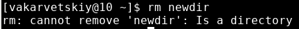  
	5. Удалил каталог newdir/morefun(см. [3.5](image/3.5.png))  
	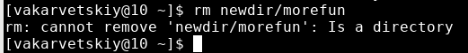  
4. С помощью man нашел опции, которые нужно использовать для просмотра содержимого подкаталогов(см. [4.1](image/4.1.png))  
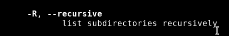  
5. С помощью man нашел опции, которые нужно использовать для сортировки по времени изменения и просмотра развернутого описания файлов(см. [5.1](image/5.1.png), [5.2](image/5.2.png))  
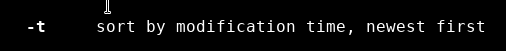  
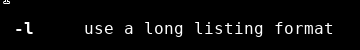  
6. Использовал man для просмотра описания команд:
	1. cd(см. [6.1](image/6.1.png))  
	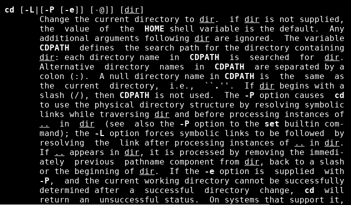  
	Основные опции - P, L (переход по символическим ссылкам), e(обработка ошибок)  
	2. pwd(см. [6.2](image/6.2.png))  
	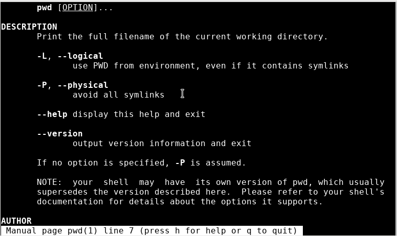  
	Основные опции - L(директория из переменной окружения), P(отбрасывать символические ссылки)  
	3. mkdir(см. [6.3](image/6.3.png))  
	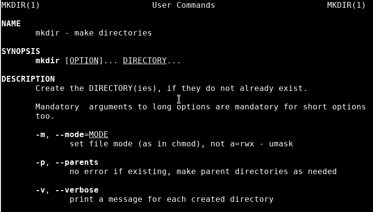  
	Основные опции - m(права доступа), p(создание всех директорий, указанных в пути), v(вывод сообщений о создании), Z(установка контекста)  
	4. rmdir(см. [6.4](image/6.4.png))  
	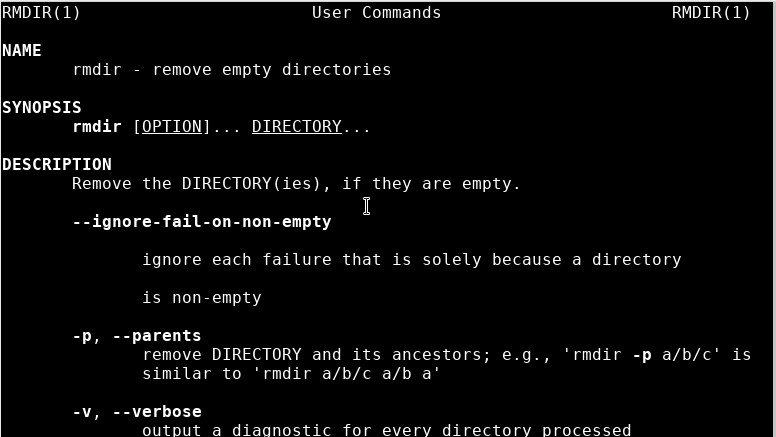  
	Основные опции - p(удаление пустых каталогов), s(скрытие сообщений)  
	5. rm(см. [6.5](image/6.5.png))  
	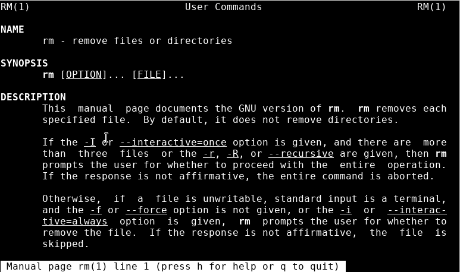  
	Основные опции - f(игнор несуществующих файлов), i(запрос на удаление), l(один запрос для всех файлов), r(рекурсивное удаление), d(удаление пустых директорий), v(инфо об удаляемых файлах)  
7. Изменил команды из буфера обмена(см. [7.1](image/7.1.png), [7.2](image/7.2.png))  
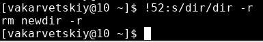  
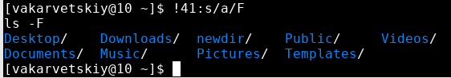  

# Выводы

Я научился работать с основными командами терминала и использовать их для работы с операционной системой

