# Цель работы

Ознакомление с файловой системой Linux, её структурой, именами и содержанием каталогов. Приобретение практических навыков по применению команд для работы с файлами и каталогами, по управлению процессами (и работами), по проверке использования диска и обслуживанию файловой системы.

# Задание

Изучить основные команды для работы с файловой системой Linux, её структурой, именами и содержанием каталогов

# Выполнение лабораторной работы

1. Выполнил все примеры  
2. 
	1. У меня не было каталога sys, поэтому взял файл из другого каталога(см. [1.1](image/1.1.png))  
	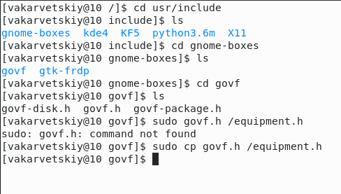  
	2. Создал директорию ski.plases(см. [1.2](image/1.2.png))  
	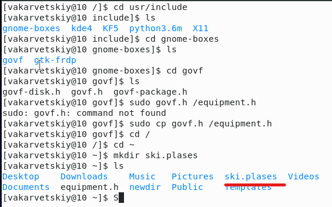  
	3. Переместил файл equipment в каталог ski.plases(см. [1.3](image/1.3.png))  
	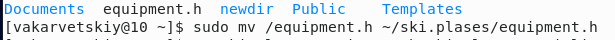  
	4. Переименовал файл(см. [1.4](image/1.4.png))  
	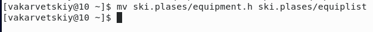  
	5. Создал файл abc1 и скопировал его в каталог ski.plases, назвав его equiplist2(см. [1.5](image/1.5.png))  
	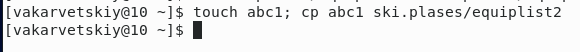  
	6. Создал каталог equipment в каталоге ski.plases(см. [1.6](image/1.6.png))  
	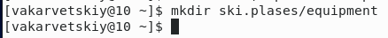  
	7. Переместил файлы equiplist и equiplist2 в каталог equipment(см. [1.7](image/1.7.png))  
	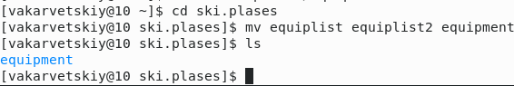  
	8. Создал и переместил каталог newdir в каталог ski.plases и назвал его plans(см. [1.8](image/1.8.png))  
	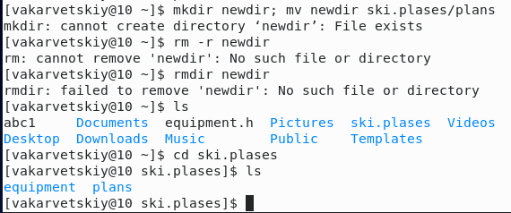  
3. Определил опции команды chmod, необходимые для присвоения файлам и каталогам необходимых прав доступа. Создал файлы(см. [3.1](image/3.1.png))  
	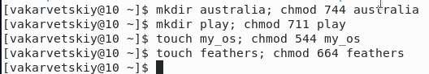  
4. 
	1. Просмотрел содержимое файла etc/passwd(см. [4.1](image/4.1.png))  
	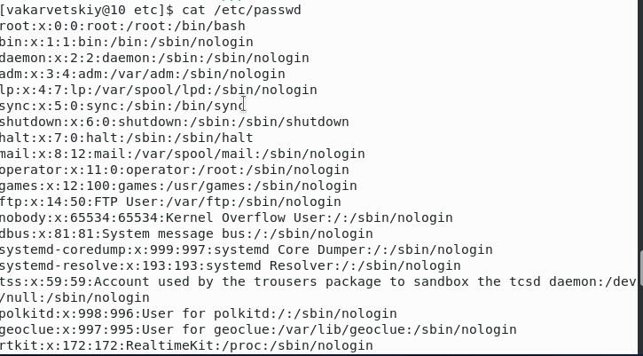  
	2. Скопировал файл feathers в файл file.old(см. [4.2](image/4.2.png))  
	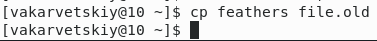  
	3. Переместил file.old в каталог play(см. [4.3](image/4.3.png))  
	  
	4. Скопировал каталог play в каталог fun(см. [4.4](image/4.4.png))  
	  
	5. Переместил каталог fun в каталог play и назвал его games(см. [4.5](image/4.5.png))  
	  
	6. Лишил владельца прав на чтение файла feathers(см. [4.6](image/4.6.png))  
	  
	7. Файл не просмотривается(см. [4.7](image/4.7.png))  
	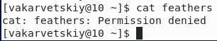  
	8. Файл не копируется(см. [4.8](image/4.8.png))  
	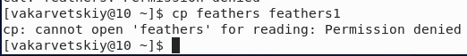  
	9. Дал владельцу право на чтение(см. [4.9](image/4.9.png))  
	  
	10. Лишил владельца права на выполнение каталога play(см. [4.10](image/4.10.png))  
	  
	11. Доступ в каталог запрещен(см. [4.11](image/4.11.png))  
	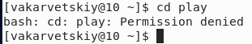  
	12. Дал владельцу право на выполнение(см. [4.12](image/4.12.png))  
	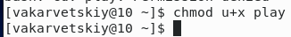  
5. Прочитал man по командам:  
	1. mount - монтирует файловую систему(см. [mount](image/mount.png))  
	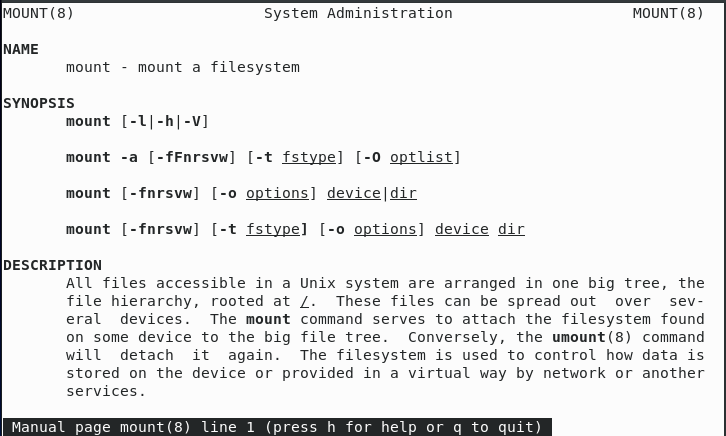  
	2. fsck - проверка файловой системы на целостность(см. [fsck](image/fsck.png))  
	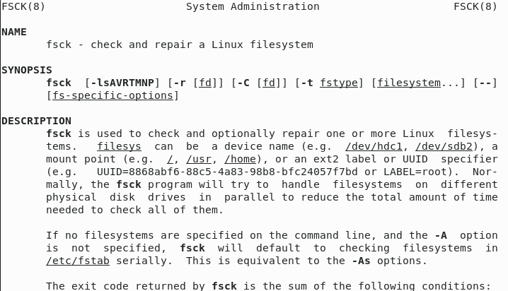  
	3. mkfs - создание новой файловой системы(см. [mkfs](image/mkfs.png))  
	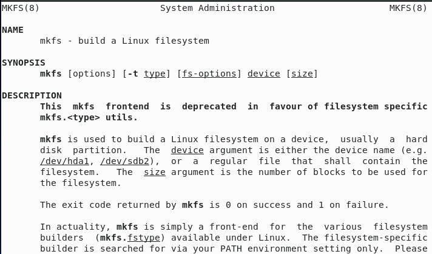  
	4. kill - убивает фоновой процесс(см. [kill](image/kill.png))  
	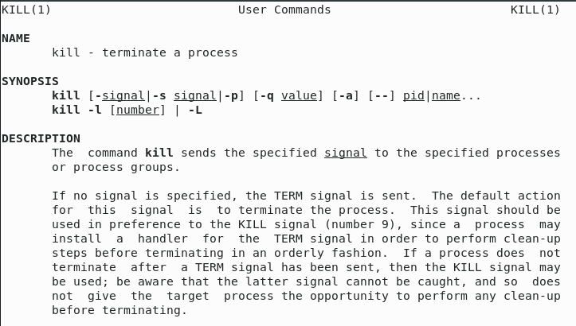  

# Выводы

Я научился использовать основные команды для работы с файловой системой Linux, её структурой, именами и содержанием каталогов
