# Цель работы

Ознакомление с инструментами поиска файлов и фильтрации текстовых данных. Приобретение практических навыков: по управлению процессами (и заданиями), по проверке использования диска и обслуживанию файловых систем.
# Задание

Изучить инструменты поиска и фильтрации файлов и каталогов. Также изучить команды для управления процессами.

# Выполнение лабораторной работы

1. Осуществил вход в систему
2. Записал в файл file.txt названия файлов из каталога /etc, а также из домашнего каталога(см. [2](image/2.png))  
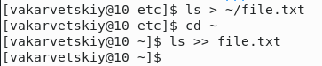  
3. Вывел имена с расширением .conf из файла file.txt и записал их в файл conf.txt(см. [3](image/3.png))  
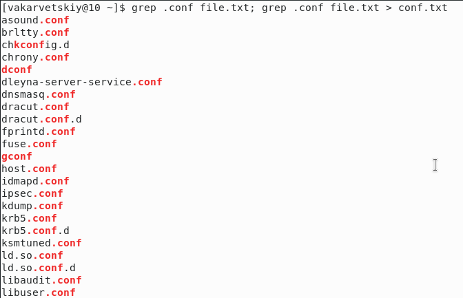  
4. Нашел файлы в домашнем каталоге, имена которых начинаются с символа "c"(см. [4.1](image/4.1.png), [4.2](image/4.2.png))  
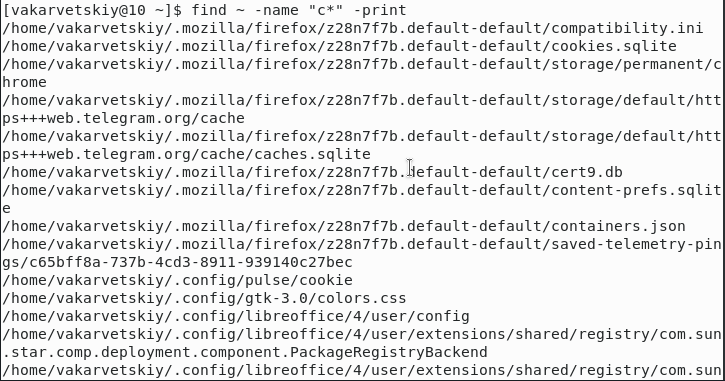  
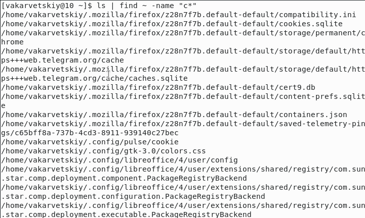  
5. Вывел на экран имена файлов из каталога /etc, имена которых начинаются с "h"(см. [5](image/5.png))  
  
6. Запустил в фоновом режиме процесс, который записывает в файл \~/logfile файлы, имена которых начинаются с "log"(см. [6](image/6.png))  
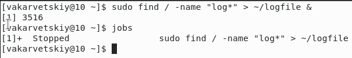  
7. Удалил файл \~/logfile(см. [7](image/7.png))  
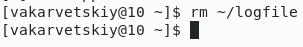  
8. Запустил в фоновом режиме редактор gedit(см. [8](image/8.png))  
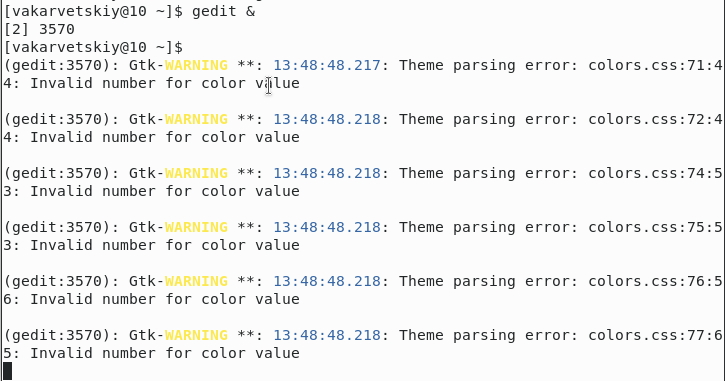  
9. Определил идентификатор процесса gedit. При запуске в фоновом режиме пишется номер созданного процесса, поэтому данные манипуляции были не обязательными(см. [9](image/9.png))  
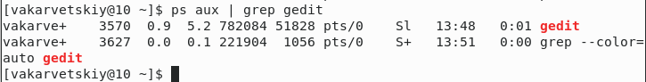  
10. Завершил процесс gedit(см. [10](image/10.png))  
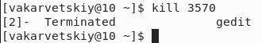  
11. Выполнил команды df и du(см. [11.1](image/11.1.png), [11.2](image/11.2.png))  
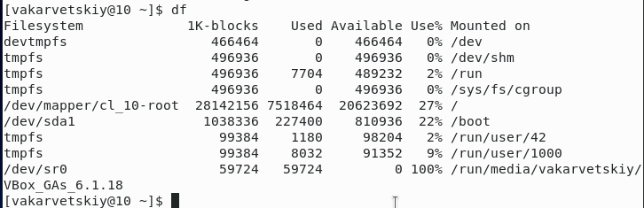  
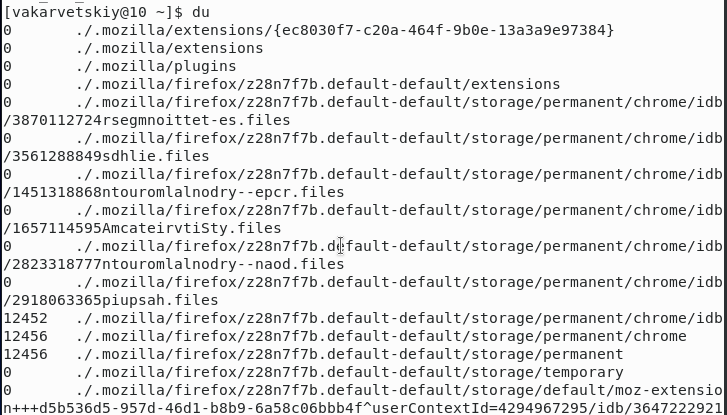  
12. Вывел имена всех директорий в домашнем каталоге(см. [12](image/12.png))  
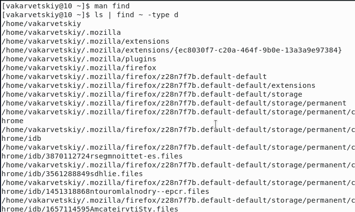  

# Выводы

Я научился применять на практике команды для поиска файлов, фильтрации текстовых данных, научился работать с фоновыми процессами.

