# Цель работы

Освоение основных возможностей командной оболочки Midnight Commander.
Приобретение навыков практической работы по просмотру каталогов и файлов; манипуляций с ними.

# Задание

Изучить интерфейс и основные принципы работы с командной оболочкой Midnight Commander. Изучить команды и комбинации для работы с файлами и текстовой информацией. 

# Выполнение лабораторной работы

1. 
	1. Изучил информацию о mc из mac
	2. Запустил mc из терминала(см. [1.2](image/1.2.png))  
	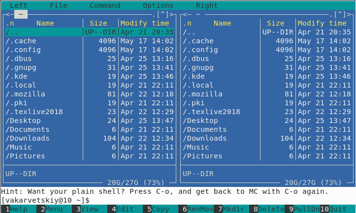  
	3. Выполнил несколько операций с использованием управляющих клавиш(см. [1.3](image/1.3.png))  
	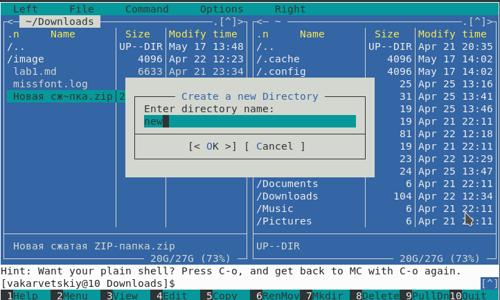  
	4. Выполнил команды из меню левой панели. Информация о файлах достаточная, подробная(см. [1.4](image/1.4.png))  
	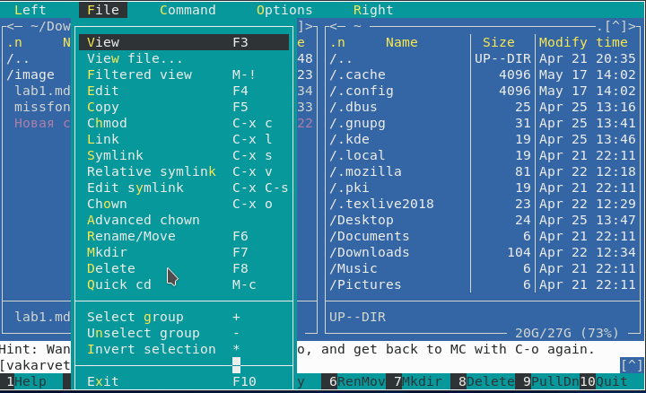  
	5. В подменю ФАЙЛ выполнил:
		1. Просмотрел содержимое файла(см. [1.5.1](image/1.5.1.png))  
		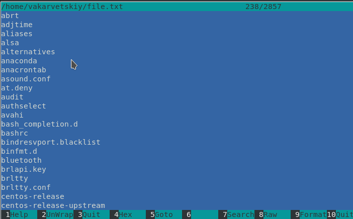  
		2. Изменил содержимое файла(см. [1.5.2](image/1.5.2.png))  
		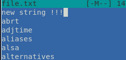  
		3. Создал каталог(см. [1.5.3](image/1.5.3.png))  
		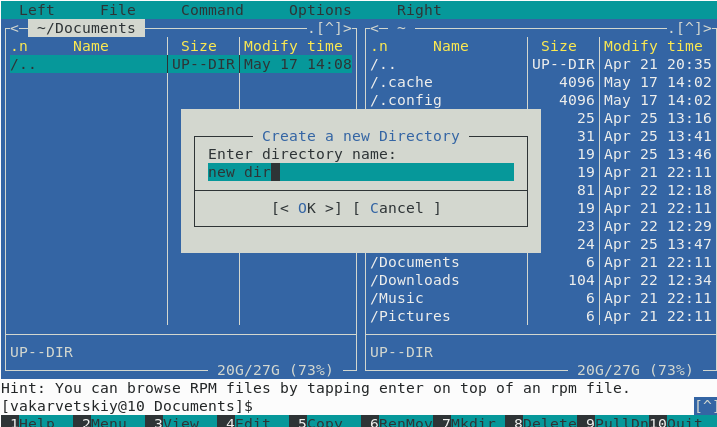  
		4. Скопировал файл в каталог(см. [1.5.4](image/1.5.4.png))  
		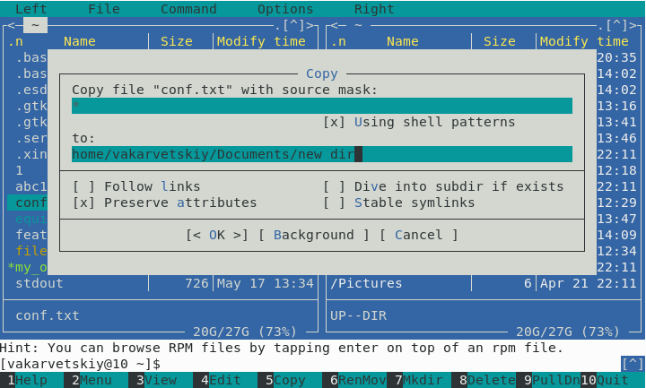  
	6. С помощью подменю КОМАНДА выполнил:
		1. Поиск по ФС с условиями(см. [1.6.1](image/1.6.1.png))  
		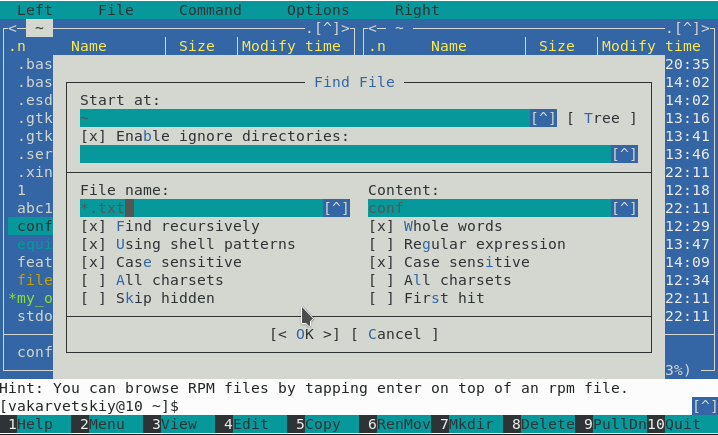  
		2. Повтор предыдущей команды(см. [1.6.2](image/1.6.2.png))  
		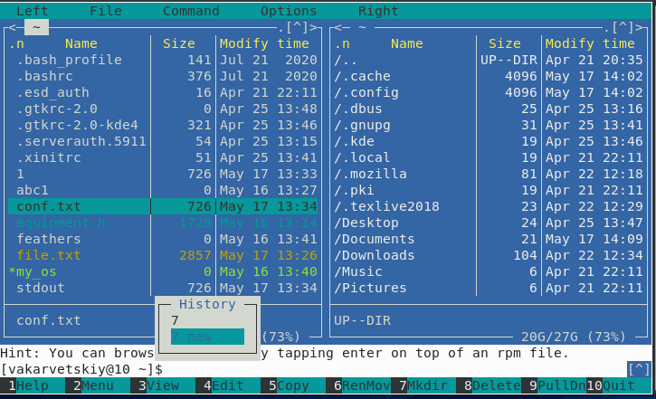  
		3. Перешел в домашний каталог(см. [1.6.3](image/1.6.3.png))  
		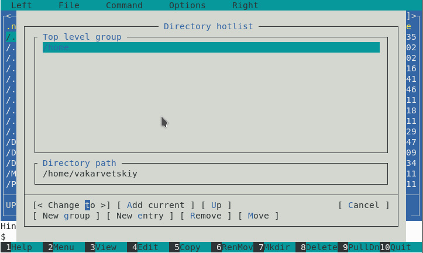  
		4. Проанализировал файлы меню и расширений(см. [1.6.4](image/1.6.4.png))  
		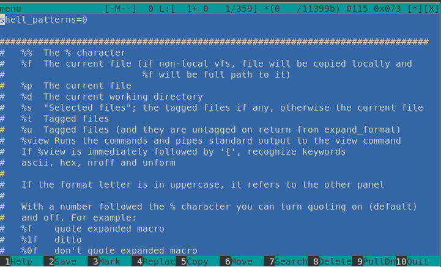  
	7. Вызвал подменю НАСТРОЙКИ, изучил(см. [1.7](image/1.7.png))  
	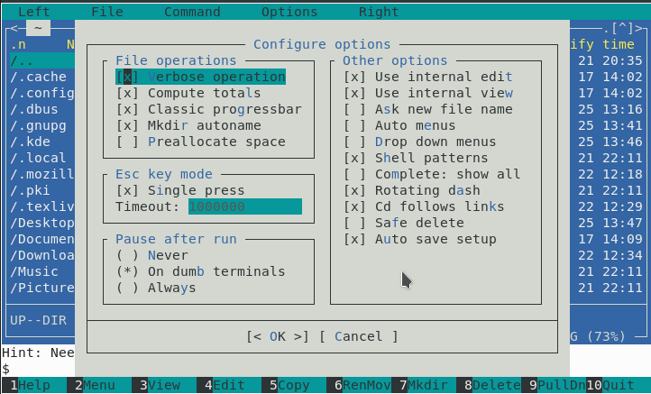  
2. 
	1. Создал текстовый файл text.txt(см. [2.1](image/2.1.png))  
	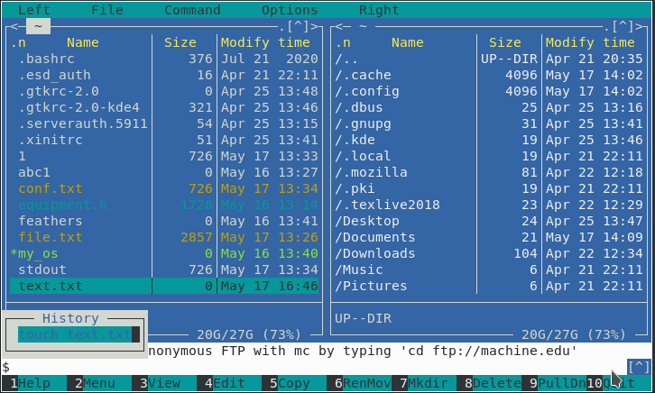  
	2. Открыл файл с помощью mc(см. [2.2](image/2.2.png))  
	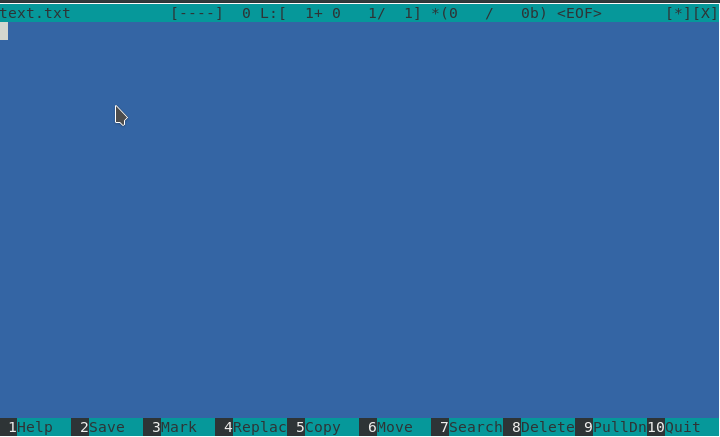  
	3. Вставил в файл фрагмент текста из интернета(см. [2.3](image/2.3.png))  
	  
	4. 
		1. Удалил строку текста(см. [2.4.1](image/2.4.1.png))  
		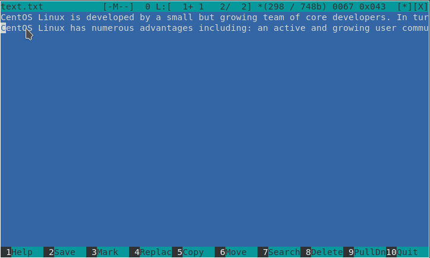  
		2. Выделил и скопировал часть текста(см. [2.4.2](image/2.4.2.png))  
		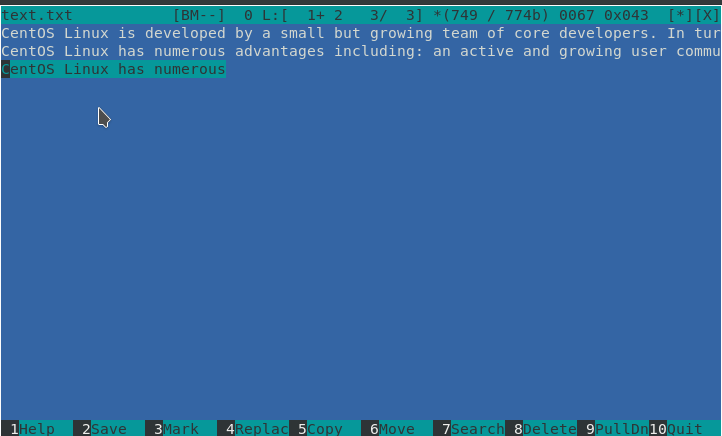  
		3. Выделил и переместил часть текста(см. [2.4.3](image/2.4.3.png))  
		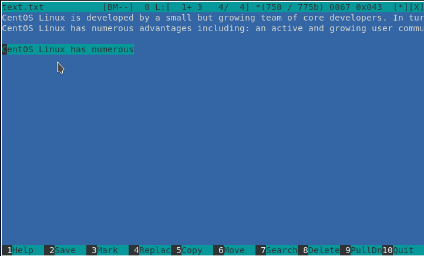  
		4. Сохранил файл(см. [2.4.4](image/2.4.4.png))  
		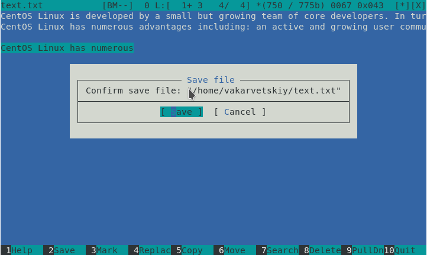  
		5. Отменил последнее действие(см. [2.4.5](image/2.4.5.png))  
		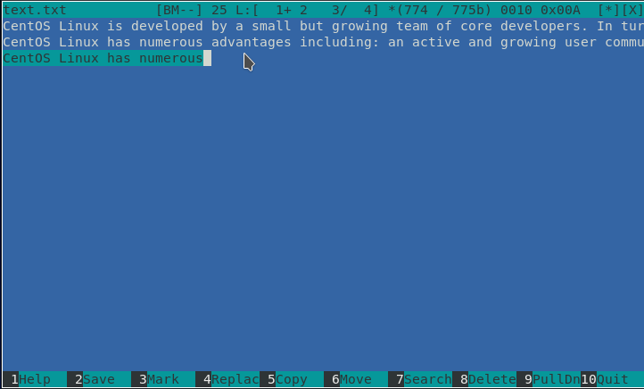  
		6. На моем ноутбуке нет необходимых клавиш. Перешел из подменю(см. [2.4.6](image/2.4.6.png))  
		7. На моем ноутбуке нет необходимых клавиш. Перешел из подменю(см. [2.4.6](image/2.4.6.png))  
		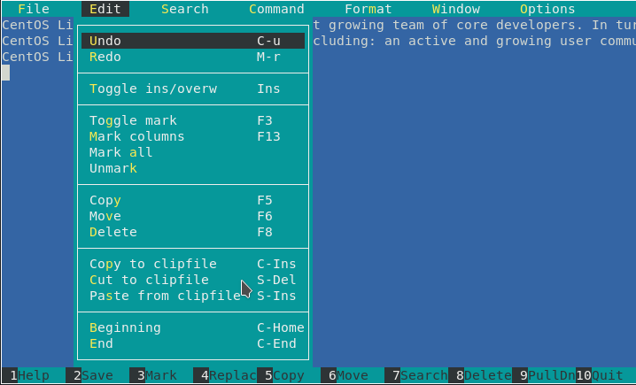  
		8. Сохранил и закрыл файл
	5. Открыл файл с исходным кодом(см. [2.5](image/2.5.png))  
	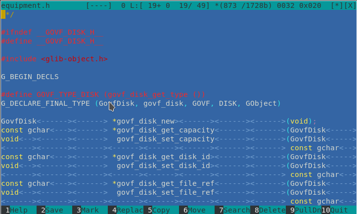  
	6. Отключил подсветку синтаксиса(см. [2.6](image/2.6.png))  
	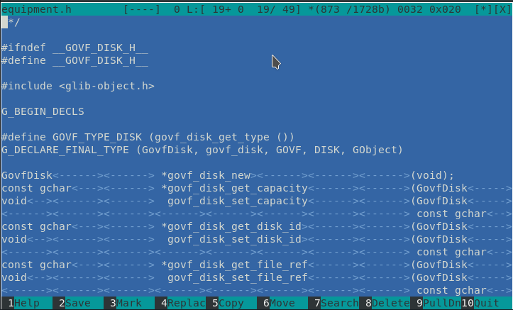  

# Выводы

Я научился работать в командной оболочке Midnight Commander, с ее встроенным графическим редактором. Производить манипуляции с файлами и каталогами