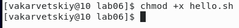
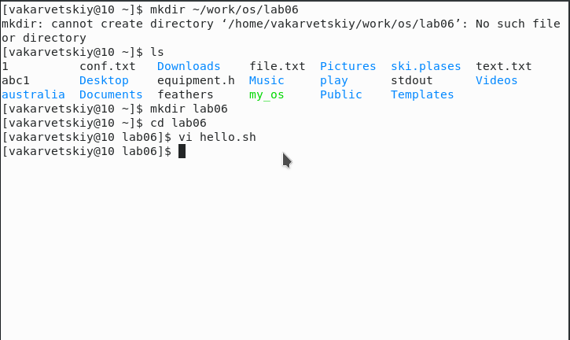

# Цель работы

Познакомиться с операционной системой Linux. Получить практические навыки работы с редактором vi, установленным по умолчанию практически во всех дистрибутивах.

# Задание

Изучить интерфейс и основные сочетания клавиш редактора vi


# Выполнение лабораторной работы

1. 
	1. Создал каталог lab06(см. [1.1](image/1.1.png))  
	  
	2. Перешел в созданный каталог(см. [1.2](image/1.2.png))  
	  
	3. Вызвал vi и создал файл командой ```vi hello.sh```(см. [1.3](image/1.3.png))  
	  
	4. Ввел текст, указанный в задании(см. [1.4](image/1.4.png))  
	  
	5. Нажал esc для перехода в командный режим
	6. Нажал ":" для перехода в режим последней строки(см. [1.6](image/1.6.png))  
	  
	7. Нажал W и Q, а затем ENTER, для сохранения файла и завершения работы с ним
	8. Сделал файл исполняемым(см. [1.8](image/1.8.png))  
	  

2. 
	1. Вызвал vi для редактирования файла hello.sh(см. [2.1](image/2.1.png))  
	  
	2. Установил курсор в конец HELL на второй строке(см. [2.2](image/2.2.png))  
	  
	3. Перешел в режим вставки и заменил на HELLO(см. [2.3](image/2.3.png))  
	  
	4. Стер LOCAL в 4 строке(см. [2.4](image/2.4.png))  
	  
	5. Перешел в режим вставки и написал local(см. [2.5](image/2.5.png))  
	  
	6. Вставил в конец файла строку "echo $HELLO"(см. [2.6](image/2.6.png))  
	  
	7. Перешел в командный режим(см. [2.7](image/2.7.png))  
	  
	8. Удалил последнюю строку(см. [2.8](image/2.8.png))  
	  
	9. Отменил последнюю команду(см. [2.9](image/2.9.png))  
	  
	10. Записал изменения и вышел из vi(см. [2.10](image/2.10.png))  
	  

# Выводы

Я научился работать в графическом редакторе vi, изучил основные команды и сочетания клавиш для работы с ним. 